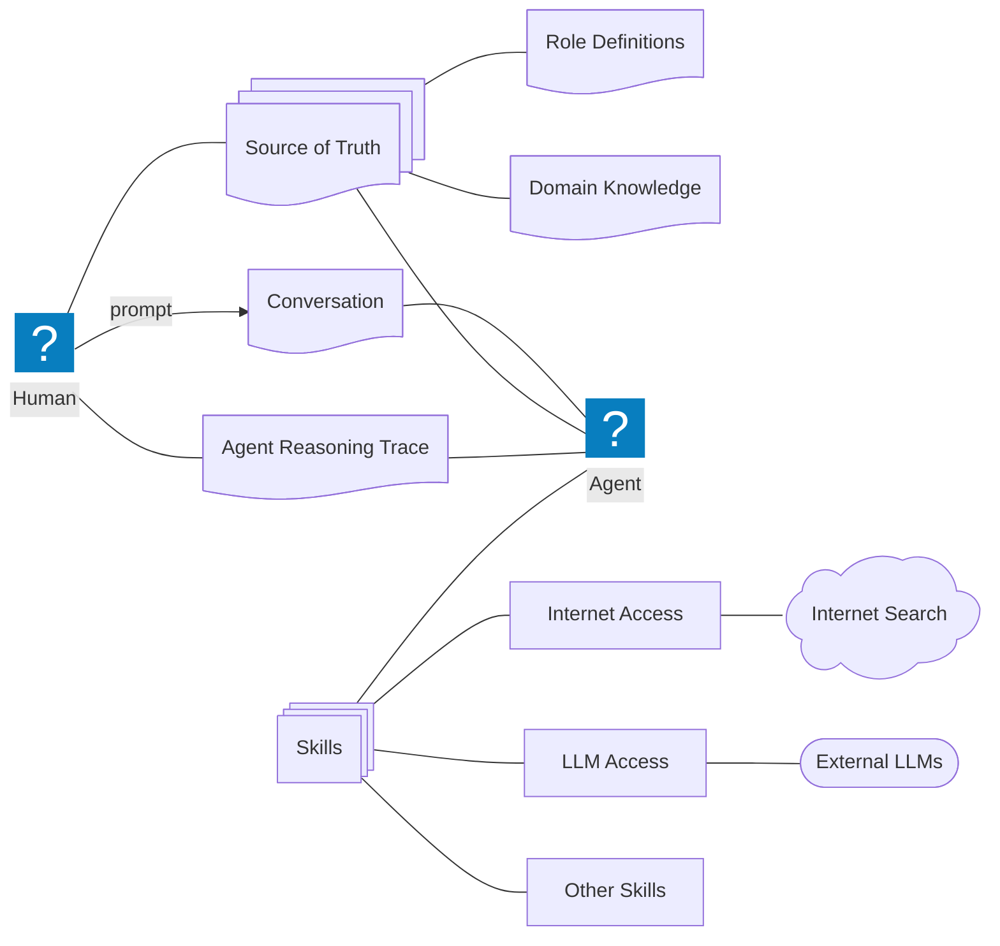

# Project Quark (Draft)

A Source-of-Truth-Driven Framework for Defining, Executing, and Evolving Roles in LLM-Based Agents

## Abstract

Large Language Model (LLM) agents are increasingly used to perform complex knowledge work, but they often suffer from role drift, inconsistent behavior across tasks, and fragile “prompt-only” role specifications. This proposal investigates a **Source of Truth (SoT)** approach to role engineering: a structured, versioned, Markdown-based repository of role definitions and domain knowledge that an agent can consult to reliably adopt and compose roles.

The research aims to define (1) an information architecture for a human- and agent-readable SoT, (2) the minimal set of artifacts required for an LLM to perform a role with measurable adherence, beyond prompt wording and model-specific heuristics, and (3) a set of base roles —*Librarian, Elicitator, Curator, Augmentator, Researcher, and Creator*- from which domain-specific roles can be derived. The work will deliver an open-source, provider-agnostic proof-of-concept and evaluate it through controlled tasks (with an initial focus on Software Engineering roles) using reproducibility, role adherence, knowledge quality, and maintenance cost as primary metrics.

## Motivation and Problem Statement

Current agent role specifications are often:

- **Implicit** (embedded in prompts and undocumented conventions).
- **Hard to maintain** (no clear update workflow or governance).
- **Difficult to reproduce** (behavior depends on prompt phrasing, model/provider details, and hidden context).
- **Unsafe for knowledge work** (hallucinations and inconsistent citations/traceability).

This proposal frames role definitions as first-class knowledge assets. A centralized SoT—kept coherent and clean—can help align agent behavior with explicit, testable role contracts.

## Research Objectives

### Primary Objective

Design and validate a **Source of Truth for role definitions** that enables an LLM-based agent to adopt and perform different roles consistently.

### Supporting Objectives

- Define an information architecture for the SoT (structure, naming, linking, versioning).
- Specify what artifacts are necessary for an LLM to perform a role (e.g., responsibilities, inputs/outputs, constraints, success criteria).
- Define and document a minimal set of base roles:  
  - **Librarian** (navigation and coherence of the SoT)
  - **Elicitator** (high-quality questioning and requirement discovery)
  - **Curator** (integration of new knowledge into the SoT)
  - **Augmentator** (metadata enrichment and agent-oriented representations)
  - **Researcher** (scientific inquiry, consolidation, knowledge creation)
  - **Creator** (composition mechanism to define new roles using the base roles)
- Propose and implement an initial software architecture for an agent that uses the SoT.
- Demonstrate feasibility by deriving and executing domain-specific roles (initially: Software Engineering).

## Research Questions (RQs)

**RQ1:** What is the minimal SoT schema (role + domain knowledge) that yields stable role execution across tasks and sessions?

**RQ2:** How can we measure “role adherence” in LLM-based agents in a way that is provider-agnostic and reproducible?

**RQ3:** Which governance mechanisms (e.g., librarian/curator workflows) reduce SoT entropy while maintaining usefulness and coverage?

**RQ4:** Can a small set of base roles be composed to produce high-quality domain-specific roles with lower maintenance cost than ad-hoc prompts?

## Scope and Constraints

- **Markdown-first:** All SoT artifacts are stored in Markdown and must be readable by humans and optimized for agent consumption.
- **Free/Open Source:** Implementation uses free and open-source software.
- **Provider-agnostic:** The architecture avoids lock-in to a specific LLM provider.

## Proposed Source of Truth (SoT) Design

### SoT Contents

The SoT will contain two primary knowledge categories:

- **Role Definitions:** Base roles and derived roles, each with explicit contracts.
- **Domain Knowledge:** Concepts, terminology, conventions, and task patterns required by domain-specific roles.

### Role Definition Template (Proposed)

Each role definition will be represented as a structured Markdown document (a “role card”) with at least:

- **Purpose:** What the role is for.
- **Responsibilities:** What the agent must do.
- **Boundaries:** What the role must not do.
- **Inputs/Outputs:** Expected artifacts (e.g., plans, summaries, patches).
- **Operating Procedure:** Steps/checklists the agent follows.
- **Quality Criteria:** How success is evaluated.
- **Failure Modes:** Common mistakes and mitigation.
- **Interfaces:** Which other roles it collaborates with and how.

This template is intentionally minimal and testable; it aims to make roles explicit, reviewable, and comparable.

## Base Roles (Operational Definitions)

### Librarian

Maintains SoT coherence.

- Navigates and retrieves the “right” knowledge from the SoT.
- Keeps the SoT clean: reduces duplication, resolves conflicts, enforces structure.
- Establishes naming conventions and linking practices.

### Elicitator

Improves problem specification through questions.

- Produces high-signal questions to clarify goals, constraints, assumptions, and risks.
- Detects ambiguity and proposes minimal, testable interpretations.

### Curator

Integrates validated knowledge into the SoT.

- Decides what is worth storing, and in what form.
- Converts outcomes into reusable role/domain artifacts.
- Ensures changes are consistent with existing structure and quality criteria.

### Augmentator

Transforms SoT content into agent-oriented representations.

- Adds metadata (tags, task types, prerequisites, confidence levels, provenance).
- Produces agent-friendly views such as checklists, decision tables, or retrieval indices derived from the SoT.

### Researcher

Applies scientific method to generate and consolidate knowledge.

- Forms hypotheses, designs experiments, collects evidence, and synthesizes conclusions.
- Distinguishes between claims, assumptions, and observed results.

### Creator (Role Composer)

Composes roles.

- Uses the Librarian/Elicitator/Curator/Augmentator/Researcher capabilities to define new roles.
- Produces new role cards with clear contracts and evaluation criteria.

## Software Architecture (Initial)

The proof-of-concept agent will:

1. Receive a user prompt.
2. Retrieve relevant SoT entries (roles + domain knowledge).
3. Execute under an explicit role contract.
4. Produce outputs and (optionally) a structured reasoning trace suitable for auditing.
5. Propose SoT updates via curator workflows when new knowledge is produced.

## Methodology and Evaluation Plan

This research follows a design-and-evaluation approach:

- Artifact design: SoT information architecture, role cards, and base role set.
- Implementation: Provider-agnostic agent that uses the SoT.
- Empirical evaluation: Controlled tasks across multiple sessions/models.

### Evaluation Dimensions

- Role adherence: Degree to which outputs match the role contract.
- Reproducibility: Stability across runs (same SoT, comparable tasks).
- Knowledge quality: Correctness, traceability, and usefulness of stored artifacts.
- Maintenance cost: Effort to update roles/domains without introducing inconsistencies.
- Task success: Objective success criteria per benchmark task.

## Expected Contributions

- A rigorous, Markdown-based SoT schema for role engineering.
- A minimal, composable base role set with operational definitions.
- A provider-agnostic reference implementation.
- An evaluation methodology and metrics for role adherence and SoT maintainability.
- Evidence (positive or negative) on whether role composition reduces prompt fragility.

## Next Steps (High-Level)

- Related work review, SoT schema design, base roles v1.  
*Related work includes prompt-based role specification, agent frameworks, and knowledge-augmented LLMs; this work differs by treating role definitions as versioned, auditable knowledge artifacts.*
- Prototype implementation, initial benchmarks, iteration.
- Controlled experiments, comparative evaluation, refinement.
- Write-up, defense preparation, open-source consolidation.

## System Overview (Simplified)

## Contributors

**Principal Investigator**  
Juan Arriagada (uFabric)  
ORCID: 0009-0009-5330-4925

## Version History

- v0.1 | 2026/02/08 | Internal draft – conceptual
